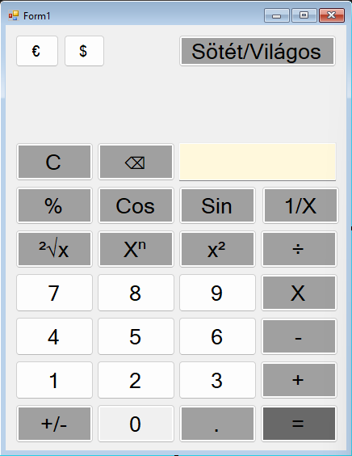

# Funkcionális specifikáció

## 1. Áttekintés
Az alkalmazás célja, egy olyan számológép létrehozása mely képes az alap számítások elvégzésére, ezen felül rendelkezik egy külön valutaátváltó funkcióval is. C# nyelven Windows Forms alkalmazásként lesz elkészítve. A számolás eredménye egy textboxban fog megjelenni.

## 2. Jelenlegi helyzet leírása
A megrendelő egy iskola, ahol nem szeretik az alap gépeken megtalálható számológépet,mivel túl sokat tudnak,ezért egy kevesebbet tudó, de hibátlan számológépet keres matematika és fölrdajz órákra, amely segítheti az ott lévő tanárokat az óráik során. A számológépnek képesnek kell lennie valutaátváltásra is, amit földrajz órához szeretnének használni.

## 3. Vágyálomrendszer leírása
A létrehozandó alkalmazás egy egyszerű, mégis hatékony számológép lesz, amely megfelel a matematika és földrajz órák igényeinek, különös tekintettel a valutaátváltási funkciókra. A felhasználói élményt egy letisztult és intuitív felhasználói felület biztosítja, minimalizálva a hibalehetőségeket és leegyszerűsítve a számolási feladatokat.
## 4. Jelenlegi üzleti folyamatok modellje
Jelenleg az órákon mindent manuálisan használnak,mivel nem szeretik a tanárok a túl sokat tudó alkalmazásokat,ami sok időt elvesz az óra idejéből,ezen felül az iskola fejleszteni akarja a meglévő módszereit.
## 5. Igényelt üzleti folyamatok modellje
Az igényelt számológép alkalmazás egy olyan eszköz lenne az iskola számára,ami egyszerű és gyors szolgáltatást nyújtana. Ezáltal az érintett órákon a diákoknak is kedvezőbb megoldást nyújtana ez az alkalmazás,mivel kevesebb időt kell fordítaniuk a számolásokra az alkalmazás miatt,a tanárnak több ideje marad az anyag elméleti részét elmagyarázni. 
## 6. Követelménylista

| Id | Modul | Név | Leírás |
| :---: | --- | --- | --- |
| 1     | Felület       | Eredmény kiírása | Kiírja a műveletek eredményt.                                      |
| 2     | Felület       | Számok 0-9       | A felhasználó ezen gombok megnyomásával tudja bevinni a számokat   |
| 3     | Modifikáció   | Összeadás        | A felhasználó által megadott értékek összeadása.                   |
| 4     | Modifikáció   | Kivonás          | A felhasználó által megadott értékek kivonása.                     |
| 5     | Modifikáció   | Százalék         | A felhasználó álltal beírt számnak egy bizonyos százalékát írja ki |
| 6     | Modifikáció   | Euróra váltás    | A kiszámolt összeg átváltása euróra.                               |
| 7     | Modifikáció   | Dollárra váltás  | A kiszámolt összeg átváltása amerikai dollárra.                    |
| 8     | Modifikáció   | Szorzás          | A felhasználó által megadott értékek szorzása.                     |
| 9     | Modifikáció   | Osztás           | A felhasználó által megadott értékek osztása.                      |
| 10    | Modifikáció   | Reciprok         | A felhasználó által megadott szám reciprokának kiszámítása.        |
| 11    | Modifikáció   | Szinusz          | A felhasználó által megadott szám szinuszának kiszámítása.         |
| 12    | Modifikáció   | Koszinusz        | A felhasználó által megadott szám koszinuszának kiszámítása.       |
| 13    | Modifikáció   | Négyzetgyök      | A felhasználó által megadott érték négyzetgyökének kiszámítása.    |
| 14    | Modifikáció   | Négyzetre emelés | A felhasználó által megadott érték négyzetre emelése.              |
| 15    | Modifikáció   | n-edik hatvány   | A felhasználó által megadott egész szám n-edik hatványra emelése.  |
| 16    | Modifikáció   | Előjel váltás    | A felhasználó által megadott szám előjelének megváltoztatása.      |

## 7. Használati esetek
Az alkalmazásunk két főbb használati esettel rendelkezik: Az első, egy matamtika órán,ahol egyszerű számításokat végezhet el a tanár,akár a gyerekek is. A második eset földrajz óra,ahol különböző pénzekkel foglalkoznak a diákok és a tanár. Itt is felgyorsítja a folyamatot ez a beépített elem.
## 8. Megfeleltetés, hogyan fedik le a használati eseteket a követelményeket

## 9. Képernyőtervek

## 10. Forgatókönyvek

Szereplők: Futási időben kettő szereplő figyelhető meg. Az
első szereplő maga a futó alkalmazás. (weben)
A webes felületen kilehet választani a kívánt számolási fajtát. Ezzel van interakcióban a második szereplő, maga a felhasználó, aki használja az alkalmazást, a kívánt adatok kitöltése az ő feladata lesz.”

## 11. Funkció - követelmény megfeleltetése

| Id | Követelmény | Funkció |
| :---: | --- | --- |
| K4 | ... | ... |

## 12 Fogalomszótár
Textbox - Szövegdoboz
